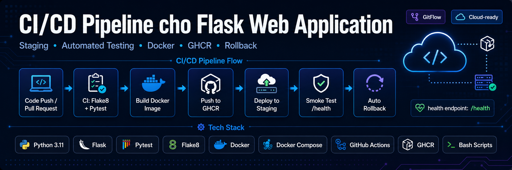

# CI/CD Pipeline cho Flask Web Application

Đồ án NT208.Q23.ANTT mô phỏng pipeline CI/CD cho ứng dụng Flask có môi trường staging, kiểm thử tự động, Docker image trên GHCR, smoke test và rollback.

## Giảng viên hướng dẫn

- ThS. Nghi Hoàng Khoa

## Thực hiện bởi nhóm 11 gồm:

- Hồ Ngọc Vương Thương - 24521749
- Phạm Trần Anh Tuấn - 24521939
- Võ Đình Hoàng Tiến - 24521783
- Hà Võ Đức Thiện - 24521658

## Lớp

NT208.Q23.ANTT

---

## 1. Giới Thiệu Đề Tài

Mục tiêu của project là xây dựng một quy trình DevOps thu gọn nhưng có đủ các bước cốt lõi của một vòng đời CI/CD hiện đại:

- Kiểm tra chất lượng source bằng Flake8.
- Chạy unit test và integration test bằng Pytest.
- Quét rò rỉ secret bằng Gitleaks trên diff và toàn bộ git history.
- Quét lỗ hổng dependency bằng pip-audit dựa trên `requirements.txt`.
- Build Docker image và tag bằng full commit SHA.
- Push image lên GitHub Container Registry (GHCR).
- Deploy tự động lên staging khi có push vào `develop`.
- Smoke test endpoint `/health` sau deploy.
- Rollback về image tag trước đó nếu smoke test fail.
- Lưu trữ cấu hình nhạy cảm bằng GitHub Secrets, không commit secret thật vào source.

Project sử dụng ứng dụng Flask đơn giản làm deployment artifact để tập trung vào pipeline, khả năng kiểm thử, truy vết version và phục hồi staging khi deployment lỗi.

## 2. Công Nghệ Dùng

| Nhóm | Công nghệ |
| --- | --- |
| Web application | Python 3.11, Flask 3.1.3 |
| Test và lint | Pytest 9.0.3, Flake8 7.3.0 |
| Security gate | Gitleaks 8.24.2, pip-audit |
| Container | Docker, Docker Compose |
| CI/CD | GitHub Actions |
| Registry | GitHub Container Registry |
| Deployment | Bash scripts, SSH staging host |
| Notification tùy chọn | Discord Webhook |
| Dependency maintenance | Dependabot |

## 3. Cấu Trúc Thư Mục

```text
.github/
  dependabot.yml          # Cập nhật dependency và GitHub Actions hằng tuần
  workflows/
    ci.yml                # CI: lint, test, dependency audit, secret scan
    cd.yml                # CD: build, push, deploy, smoke test, rollback
app/
  __init__.py             # Flask app factory
  config.py               # Cấu hình qua environment variables
  routes.py               # API endpoints
scripts/
  deploy.sh               # Deploy image mới lên staging và lưu current/previous tag
  rollback.sh             # Rollback về previous image tag
  smoke_test.sh           # Retry /health và xác nhận JSON {"status": "ok"}
tests/
  conftest.py             # Pytest fixtures
  test_unit.py            # Unit tests
  test_integration.py     # Integration tests cho HTTP endpoints
docs/
  demo-checklist.md       # Checklist evidence D1-D4
  implementation-alignment.md
  pipeline-measurement.md # Bảng đo thời gian pipeline
.dockerignore             # Loại context, cache, secret khỏi Docker build
.env.example              # Mẫu biến môi trường, không chứa secret thật
.gitleaks.toml            # Rule và allowlist cho Gitleaks
.pre-commit-config.yaml   # Gitleaks và basic file checks trước commit
Dockerfile                # Docker image Python 3.11, chạy bằng non-root user
docker-compose.yml        # Staging runtime và healthcheck
requirements.txt          # Python dependencies
run.py                    # Entry point Flask app
overview.png              # Sơ đồ tổng quan pipeline
```

## 4. Tổng Quan Ứng Dụng

Ứng dụng Flask được thiết kế theo factory pattern trong `app/__init__.py`, đọc cấu hình từ `app/config.py` và đăng ký route trong `app/routes.py`.

| Endpoint | Method | Mục đích |
| --- | --- | --- |
| `/` | GET | Trả về metadata của app: tên app, version, environment |
| `/health` | GET | Health contract cho smoke test, trả về `{"status": "ok"}` |
| `/api/items` | GET | Trả về danh sách item mẫu |
| `/api/items/<id>` | GET | Trả về item theo ID hoặc 404 nếu không tồn tại |
| `/api/items` | POST | Tạo item mới, trả về 201 hoặc 400 nếu request không hợp lệ |

Các biến môi trường chính:

| Biến | Giá trị mặc định | Ghi chú |
| --- | --- | --- |
| `APP_VERSION` | `dev` | Được inject bằng commit SHA khi deploy |
| `FLASK_ENV` | `development` | `development`, `staging` hoặc giá trị tùy biến |
| `FLASK_HOST` | `0.0.0.0` | Host bind của Flask app |
| `FLASK_PORT` | `5000` | Port runtime |
| `SECRET_KEY` | `change-me` | Chỉ dùng placeholder local, secret thật nằm trong GitHub Secrets |

## 5. CI Pipeline

File: `.github/workflows/ci.yml`

Trigger:

- `push` vào `develop`
- `pull_request` vào `develop` hoặc `main`
- Lịch hằng tuần vào 02:00 thứ Hai để chạy lại audit

CI gồm 3 job độc lập:

| Job | Vai trò | Công cụ |
| --- | --- | --- |
| `lint-and-test` | Kiểm tra style và test ứng dụng | Flake8, Pytest |
| `security-audit` | Phát hiện dependency có CVE đã công bố | pip-audit |
| `secret-scan` | Phát hiện secret bị commit vào diff hoặc git history | Gitleaks |

Luồng `lint-and-test`:

1. Checkout source.
2. Setup Python 3.11 và pip cache.
3. Cài dependency từ `requirements.txt`.
4. Chạy `flake8 app tests`.
5. Chạy `pytest tests/test_unit.py -v`.
6. Chạy `pytest tests/test_integration.py -v`.
7. Ghi CI summary gồm commit, status và duration.

Luồng `security-audit`:

1. Cài `pip-audit`.
2. Audit `requirements.txt`.
3. Tạo `pip-audit-report.json`, `pip-audit-report.txt` và `dependency-audit-evidence.txt`.
4. Ghi Dependency Audit Summary vào GitHub Actions Summary.
5. Gửi Discord notification nếu audit fail và `DISCORD_WEBHOOK_URL` được cấu hình.
6. Fail job nếu phát hiện lỗ hổng dependency.

Luồng `secret-scan`:

1. Checkout full history với `fetch-depth: 0`.
2. Cài Gitleaks CLI version `8.24.2`.
3. Scan diff của PR/push để chặn secret mới.
4. Scan full git history để phát hiện secret đã từng bị commit.
5. Upload artifact gồm report diff, report history và evidence.
6. Gửi Discord notification nếu có finding và `DISCORD_WEBHOOK_URL` được cấu hình.
7. Fail job nếu Gitleaks phát hiện secret.

## 6. CD Pipeline

File: `.github/workflows/cd.yml`

Trigger:

- `push` vào `develop`

Job `build-and-push`:

1. Resolve image name theo repo: `ghcr.io/<owner>/<repo>`.
2. Login GHCR bằng `GITHUB_TOKEN`.
3. Pull tag `latest` nếu có để làm build cache.
4. Build Docker image với 2 tag:
   - full commit SHA: `${{ github.sha }}`
   - `latest`
5. Push cả 2 tag lên GHCR.
6. Ghi CD Build Summary.

Job `deploy-and-test`:

1. SSH vào staging host bằng `STAGING_SSH_KEY`.
2. Clone repo nếu chưa có, sau đó reset về `origin/develop`.
3. Optional login GHCR bằng `GHCR_READ_TOKEN` nếu package private.
4. Export `REGISTRY_IMAGE` và chạy `scripts/deploy.sh <full_sha>`.
5. Chạy `scripts/smoke_test.sh http://localhost:5000/health` trên staging host.
6. Nếu smoke test pass, ghi log thành công và gửi Discord notification nếu được cấu hình.
7. Nếu smoke test fail, chạy `scripts/rollback.sh`.
8. Chạy smoke test lại sau rollback.
9. Ghi CD Deploy Summary.

Quy ước quan trọng:

- Deploy và rollback dùng full commit SHA, không deploy bằng `latest`.
- Tag `latest` chỉ dùng để quan sát và làm cache build.
- Smoke test retry 5 lần, mỗi lần cách 5 giây.
- Smoke test trong CD chạy trên staging host qua SSH, nên `localhost:5000` là localhost của staging server.
- Rollback state nằm trong `$HOME/staging-state/ci-cd-pipeline/.current_tag` và `.previous_tag`.
- Compose healthcheck dùng Python standard library, không phụ thuộc `curl` trong image.
- Deploy script chỉ prune dangling images bằng `docker image prune -f`, không dùng lệnh cleanup phá hủy rộng.

## 7. Bảo Mật Và Quản Lý Dependency

Project có 3 lớp bảo vệ chính:

| Lớp | Mô tả |
| --- | --- |
| Local prevention | `.pre-commit-config.yaml` chạy Gitleaks, `check-yaml`, `end-of-file-fixer`, `trailing-whitespace` trước commit |
| CI secret scan | Gitleaks scan cả changed commits và full git history bằng config `.gitleaks.toml` |
| CI dependency audit | pip-audit kiểm tra dependency trong `requirements.txt`; Dependabot tạo PR update hằng tuần |

Dependabot được cấu hình cho:

- Python dependencies trong `requirements.txt`, target branch `develop`, lịch thứ Hai 03:00 Asia/Ho_Chi_Minh.
- GitHub Actions, target branch `develop`, lịch thứ Ba 03:30 Asia/Ho_Chi_Minh.
- Bỏ qua major updates để giảm rủi ro breaking change trong phạm vi đồ án.

## 8. Cấu Hình GitHub Secrets

Bắt buộc:

| Secret | Mục đích |
| --- | --- |
| `STAGING_HOST` | IP hoặc hostname staging server |
| `STAGING_USER` | User SSH trên staging server |
| `STAGING_SSH_KEY` | Private key SSH để GitHub Actions kết nối staging |

Tùy chọn:

| Secret | Mục đích |
| --- | --- |
| `STAGING_SSH_PORT` | SSH port nếu không dùng port mặc định 22 |
| `GHCR_READ_TOKEN` | Token read-only để staging pull private GHCR image |
| `DISCORD_WEBHOOK_URL` | Webhook Discord cho security alert, deploy success và rollback |

Không sử dụng:

- `STAGING_PASSWORD`: workflow hiện tại dùng SSH key.
- Secret thật trong `.env`, Dockerfile, docker-compose hoặc source code.

## 9. Kịch Bản Demo D1-D4

Chi tiết checklist nằm trong `docs/demo-checklist.md`.

| Mã | Kịch bản | Evidence cần thu |
| --- | --- | --- |
| D1 | CI fail | PR status đỏ, log step fail, branch protection chặn merge |
| D2 | Deploy pass | CI xanh, CD build/push/deploy xanh, GHCR có tag full SHA, `/health` trả 200 |
| D3 | Rollback | Smoke test fail, rollback được trigger, post-rollback smoke test pass |
| D4 | Time measurement | Duration trong GitHub Actions Summary và bảng đo trong `docs/pipeline-measurement.md` |

## 10. Troubleshooting

Docker daemon chưa chạy:

```text
failed to connect to the docker API
```

Xử lý: bật Docker Desktop hoặc Docker Engine trên staging host.

Staging pull GHCR image fail:

- Kiểm tra package visibility.
- Nếu GHCR private, cấu hình `GHCR_READ_TOKEN`.
- Login thử trên staging: `docker login ghcr.io`.

SSH deploy fail:

- Kiểm tra `STAGING_HOST`, `STAGING_USER`, `STAGING_SSH_KEY`, `STAGING_SSH_PORT`.
- Đảm bảo public key tương ứng đã nằm trong `~/.ssh/authorized_keys` trên staging.

Smoke test fail sau deploy:

- Xem log `scripts/smoke_test.sh`.
- Kiểm tra `docker compose ps`.
- Kiểm tra `docker logs staging_web_app`.
- Nếu rollback thành công, log CD sẽ có `Rollback recovered`.

Gitleaks fail:

- Tải artifact `gitleaks-secret-scan-<run_id>` trên GitHub Actions.
- Đọc `gitleaks-diff-report.json` để xử lý secret mới.
- Đọc `gitleaks-history-report.json` nếu finding nằm trong lịch sử commit.
- Rotate secret thật nếu nó đã từng bị commit.

pip-audit fail:

- Tải `pip-audit-report.json` hoặc xem log `pip-audit-report.txt`.
- Ưu tiên merge PR Dependabot nếu bản fix phù hợp đã được tạo.
- Nếu chưa có bản fix, ghi nhận CVE và lý do chấp nhận rủi ro trong báo cáo.
